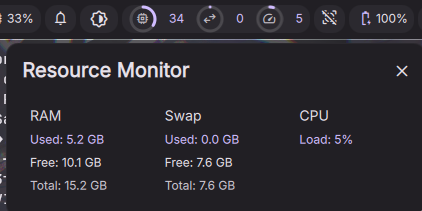

## Resource Monitor

Real-time CPU, memory, and swap usage widget for Dank Material Shell.



### Features

- Compact bar widget with circular usage indicators for RAM, swap, and CPU
- Popout with current RAM, swap, and CPU details
- Configurable auto-refresh interval in seconds
- `0` disables background auto-refresh while still taking one fresh sample when the popout opens

### Installation

Copy this repository's files into your DMS plugins directory so the final structure is:

```text
~/.config/DankMaterialShell/plugins/resourceMonitor/
  plugin.json
  ResourceMonitor.qml
  ResourceSettings.qml
```

Then reload Dank Material Shell or the plugin.

### Configuration

Open the plugin settings and set the refresh interval in seconds.

- Default: `5`
- Minimum: `0`
- Maximum: `300`

### Notes

- This plugin reads system usage from `/proc/meminfo` and `/proc/stat`.
- No extra package dependencies are required on a standard Linux system.
